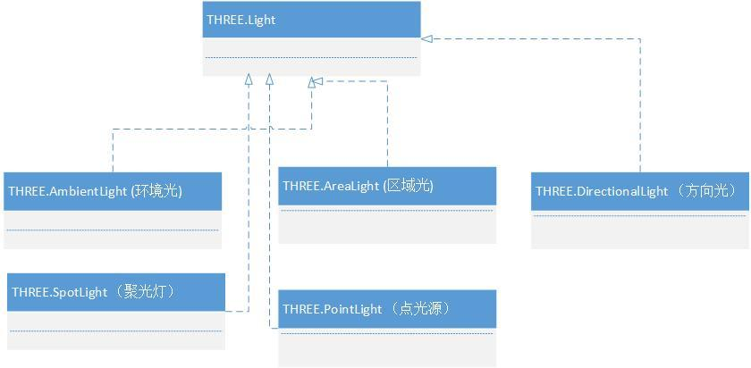
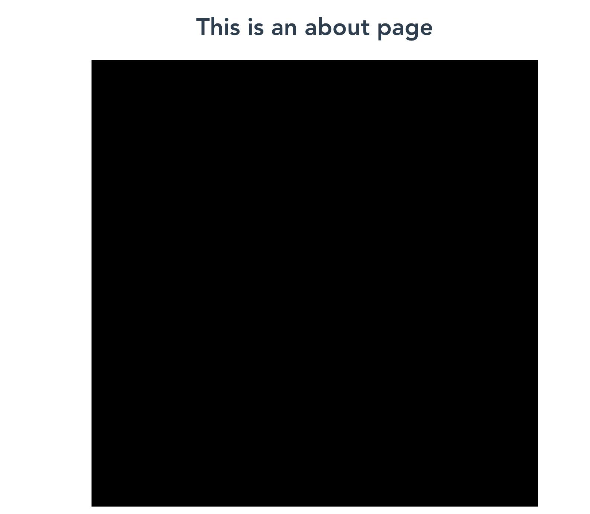
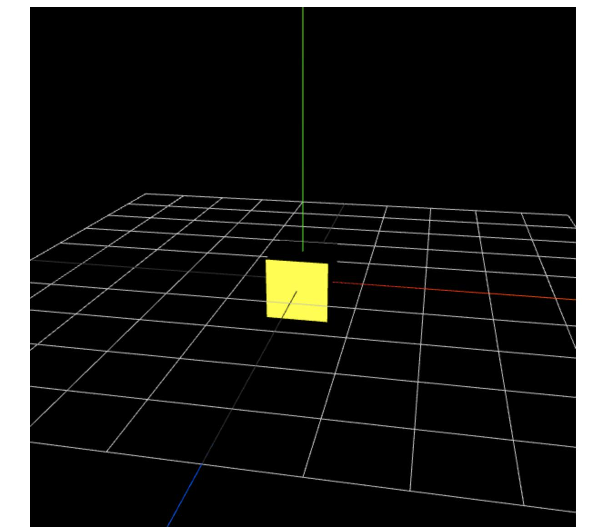
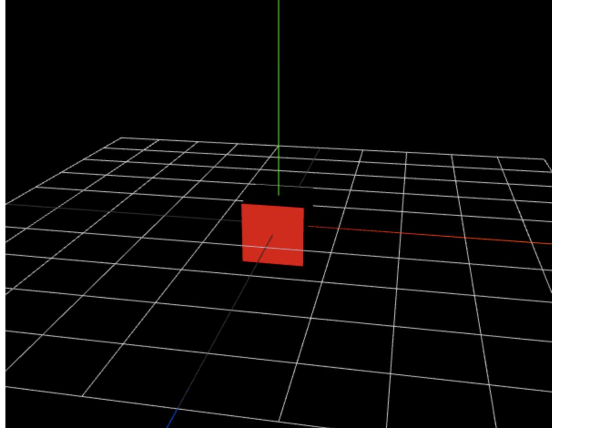
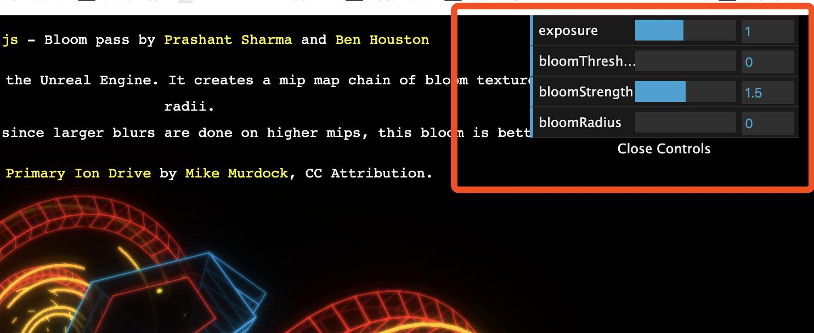

早些年就听说过D3和three.js，但是学习的难度劝退了我，现在重新捡起来，一是正好项目提前结束有了休息的时间，二是three.js的确能做出很酷炫的效果，着实令人心动
### 开始
开始学习前首先是很重要的，在项目中，特别是vue项目中引入three.js的方法。
1、首先安装three.js
`npm install three`
2.接下来利用npm安装轨道控件插件：
`npm install three-orbit-controls`
3.接下来安装加载.obj和.mtl文件的插件：
`npm i --save three-obj-mtl-loader`
4.安装渲染器插件：
`npm i --save three-css2drender`
5、安装好以后，在页面中引入three.js并使用，在所调用页面引入的代码为：
`import * as Three from ‘three’`
原文链接：https://blog.csdn.net/baidu_41601299/article/details/88663673

*补充：*
如下载three.js辅助库[ stats.js ](https://github.com/mrdoob/stats.js),可以运行这行命令：
`npm install stats.js`

<a name="1">补充二:</a>
~~如需下载通道后期处理插件PostProcessing [npm链接](https://www.npmjs.com/package/postprocessing)
`npm install three postprocessing`~~
 *切记！*不要去下载npm的打包好的插件，因为时效性比较差，最好的方法是去官方开源项目直接下载然后引入
```javascript
import { Clock, PerspectiveCamera, Scene, WebGLRenderer } from "three";
import { BloomEffect, EffectComposer, EffectPass, RenderPass } from "postprocessing";
……
const composer = new EffectComposer(new WebGLRenderer()); // 用法举例
```

*这个插件只包含了部分PostProcessing下的插件集合*，如果想引入其他的插件，具体看<a href="#2"> 效果 </a>那一章

### First Demo
```html
<template>
  <div>
    <div id="container"></div>
  </div>
</template>

<script>
  import * as Three from 'three'

  export default {
    name: 'ThreeTest',
    data () {
      return {
        camera: null,
        scene: null,
        renderer: null,
        mesh: null
      }
    },
    methods: {
      init: function () {
        let container = document.getElementById('container')
        this.camera = new Three.PerspectiveCamera(70, container.clientWidth / container.clientHeight, 0.01, 10)
        this.camera.position.z = 0.6
        this.scene = new Three.Scene()
        let geometry = new Three.BoxGeometry(0.2, 0.2, 0.2)
        let material = new Three.MeshNormalMaterial()
        this.mesh = new Three.Mesh(geometry, material)
        this.scene.add(this.mesh)

        this.renderer = new Three.WebGLRenderer({antialias: true})
        this.renderer.setSize(container.clientWidth, container.clientHeight)
        container.appendChild(this.renderer.domElement)
      },
      animate: function () {
        requestAnimationFrame(this.animate)
        this.mesh.rotation.x += 0.01
        this.mesh.rotation.y += 0.02
        this.renderer.render(this.scene, this.camera)
      }
    },
    mounted () {
      this.init()
      this.animate()
    }
  }
</script>
<style scoped>
  #container {
    height: 400px;
  }
</style>
```
以上代码运行后，应该能看大一个在旋转着的多色正方体。

### 三要素
在three.js中想要将物体渲染到浏览器中，必须设置三个要素，分别是场景（scene）、相机（camera）和渲染器（renderer）。
#### 场景(scene)
场景的概念很容易理解，如果将html比作一个空间，我们希望在这个空间内上演一出戏码，那么首先需要给这场戏布置一个场景或者说是舞台，布置的方法也很简单，只需要new一个对象
`var scene = new THREE.Scene();`

#### 相机(camera)
一场戏的呈现离不开看的人，也就是观众，camera通俗的来说就是视角点。
我们设置了舞台之后我们还需要设置观众席或摄像机的位置。
视角点的设置是决定这场戏呈现出来的最终效果的决定因素之一，有了视角点我们就可以轻易的控制哪些东西出现或不出现在观众和镜头的视线范围内。

相机(camera)和场景不同，可以有很多种，就好比摄影中的各个镜头，一般我们最常用的是*透视相机(THREE.PerspectiveCamera)*
我们在定义新相机的时候必须先指定一个相机类型。
每个相机类型都是一个构造函数。这里我们只列出了PerspectiveCamera函数的用法。

```javascript
PerspectiveCamera(fov, aspect, near, far)
```
`Fov`(int): 相机的视锥体的垂直视野角
`Aspect`(init): 相机视锥体的长宽比
`Near`(int): 相机视锥体的近平面
`Far`(int): 相机视锥体的远平面

举个栗子：
`var camera = new THREE.PerspectiveCamera(75, window.innerWidth/window.innerHeight, 0.1, 1000);`

#### 渲染器（renderer）
几乎所有的在web中渲染图形的工具或框架中（例如echarts）,最后的一步都是渲染。
渲染一般作为最后一个步骤，当我们把所有的静态图形，场景，相机等全部设置完毕后，进行渲染即可在web中看到最终效果。
而我们在进行渲染前，必须先准备一个渲染器。
定义一个渲染器可分以下三步
```javascript
var renderer = new THREE.WebGLRenderer(); // 定义一个渲染器
renderer.setSize(window.innerWidth, window.innerHeight); // 渲染器设置高宽
document.body.appendChild(renderer.domElement); // 将渲染器中的dom加入到指定的容器dom中
```

### 准备完毕
当我们准备完了三要素之后，我们就该正式开演了，开演的这个过程我们也叫做渲染。
渲染在这里是动词，和三要素之一的渲染器不同，渲染器是名词，用来指定渲染方式，渲染大小等内容
而最终我们需要*用渲染器将准备好的元素渲染到网页上*

```javascript
renderer.render( scene, camera, renderTarget, forceClear )
```
`scene`：必填。定义好的场景
`camera`：必填。定义好的相机
`renderTarget`：非必填。渲染的目标，默认是渲染到前面定义的render变量中
`forceClear`：非必填。每次绘制之前都将画布的内容给清除，即使自动清除标志autoClear为false，也会清除。

### 重要元素
一场戏要能被称为戏，必不可少的元素还有很多，我们上述的三要素，仅仅是让我们的架子可以呈现出来，然而最关键的内容却为空，那就不能称之为戏。
而这也是开发中最复杂最难的元素之一。
#### Heroes
首先我们需要演员或者道具出现在舞台上，在three.js中我们称他们为Things，物体。
物体需要出现在舞台上分两步，当然这两步都是在渲染前进行的。
第一步：定义一个物体 第二步：把物体添加到`舞台上`，就这么简单【X
```javascript
……省略参数定义
var line = new Three.Line(Geometry, Material );// 定义一条线,参数内容放到下面详述
this.scene.add( line ); // 加入到场景中
```

##### Object
three内置了多重对象，用于定义一个物体的类型，上述例子中，定义的就是一个线的对象作为物体。

要注意的是，在开发过程中，我们往往定义好了材料和模型之后再写对象，但是对象的选择在开发过程中需要作为定义物体时*第一个思考*的内容，因为对象*直接决定*了材料和模型二者的*可选范围*。
比如我想画一个点，那就必须先定义一个点的对象作为物体，然后再选择点对象下可选择的材料和模型。

我们定义了一个对象后，该对象仍然只是一个空壳，我们需要给对象传入对象的材料和模型(部分对象不需要材质或者模型，需根据对象来决定是否传入)
也就是上述代码中构造函数内的两个传参，Material和Geometry
##### Material(材料)
首先介绍的是Material，字面意思是材料，但是在three.js中，Material的构造函数和我们日常生活中的材料的定义有所不同。
材料的种类有很多，在文档中我们可以分别查看到。这里不多赘述

在实际开发过程中最复杂也是最常用的材料之一ShaderMaterial,另开一片叙述。

##### Geometry(模型)
任何的things构造函数都需要Material和Geometry两项参数。Geometry表示该物体选用的几何模型。

当我们选用一个几何的时候，Geometry该选择哪个的问题很容易得到答案
three.js提供了大量的模型可供选择，例如平面模型PlaneGeometry，平面圆模型CircleBufferGeometry，
在比如盒子模型BoxGeometry，环形扭结模型TorusKnotGeometry等等。
```javascript
var geometry = new Three.PlaneGeometry( 5, 20, 32); // 由于第三步中的对象是Mesh网点对象，PlaneGeometry属于Mesh对象之一，因此可以选此模型。
var material = new Three.MeshBasicMaterial( {color: 0xffff00, side: Three.DoubleSide} ); // 由于对象是Mesh,模型是平面模型，可选材料被限制，MeshBasicMaterial为这种情况下可选的材料。
var planeDemo = new Three.Mesh( geometry, material );// 选择网点对象Mesh，将模型和材料作为参数传入对象。
this.scene.add( planeDemo );
```

重要的事情说两遍，需要注意的是，模型也需要根据对象的类型去选择。

---
小结：文章写到这里，如果理解透了的话，已经可以写出大部分的最基本的静态物体了。可以先试着写一个人脸模型或是一个静态粒子图
#### Lights
我们需要体现质感和更加丰富立体的物体时，灯光就是个强力的帮手，
three.js中同样提供灯光设置。

------------- 中场休息 -------------

俗话说一口吃不成胖子，研究和学习也不是一两天就直接能成大神的，研究了两天three.js后目前我能制作出的也只是简单的视角变化粒子动画而已。有很多更加酷炫的效果，更多好玩的动画，还需要更深入的研究。

这一小节说的是灯光的设置，这在塑造立体感中是绝不可缺的设置之一。
基础光的设置非常简单
```javascript
Var redLight = new THREE.Light(0xFF0000); // 一个红色光
```
THREE.Light只是其他所有光源的基类，要让光源除了具有颜色的特性之外，我们需要其他光源。看看，下面的类图，是目前光源的继承结构。


#### 光与材料的关系
光与材料的关系，紧密相连。
这里举个例子，有一种材料，属性值中有颜色，但是无论设置什么颜色，在没有设置光的情况下最终表现都是黑色，这种材料也是种常用材料，MeshLambertMaterial,中文译名为兰伯特网格材质

```javascript
<!-- 省略其他初始化基本元素 -->
var geometry = new Three.BoxGeometry( 10,10,10);// 盒子模型
var material = new Three.MeshLambertMaterial( { color:0xFFFF00} );// 兰伯特材料设置为黄色
var mesh = new Three.Mesh( geometry,material);
// 设置光源
var light = new Three.DirectionalLight(0xffffff, 0.5);// 这里设置的是平行光
light.position.set(0,0,1);
scene.add(light);

mesh.position.set(0,0,0);
scene.add(mesh);
this.renderer.render(scene, camera);
```

以上代码中，如果去掉光源添加，页面中表现是这样的：

我们简单的给他加一个白光的话，为了更清晰的看到效果，我设置了一些辅助的坐标轴和平面的显示，表现是这样：

我们可以看出物体最终表现出来的颜色与光有关，我们设置光源为白色，物体为黄色，最终呈现出的是黄色的物体。
可能有人会以为光的颜色对物体没有影响，其实不然。

还是以上代码。我们把光的颜色设置为红色
```
var light = new Three.DirectionalLight(0xe20000, 0.5);/
```
效果最终是这样的。

其实物体最终呈现出来的颜色是光线颜色和物体本身颜色的叠加色。如果我们设置光线为正蓝色，物体为正黄色的话，物体最终会表现为黑色。

#### 纹理
##### 基础纹理
纹理对于一个物体有多重要是很容易被发现的一件事情。因为我们的眼睛无时无刻不在观察着周围的一切物体。
常年混迹小破站看多了MMD之后的心得也告诉我，一个物体想要有更强的质感和更多的高级感，纹理就是必须的。

three.js里设置纹理，简单的来说是靠贴图的方式，那么怎么添加贴图呢。
纹理类由three.Texture表示。定义一个新纹理可以这样写：
three.Texture构造函数为：
`THREE.Texture( image, mapping, wrapS, wrapT, magFilter, minFilter, format, type, anisotropy )`
具体每个参数的意思和支持类型可查询文档，实际使用例子
```javascript
<!-- 省略其他基础要素 -->
var geometry = new THREE.PlaneGeometry( 500, 300, 1, 1 ) // 画个平面
geometry.vertices[0].uv = new THREE.Vector2(0,0);// 纹理坐标由顶点的uv成员来表示,
geometry.vertices[1].uv = new THREE.Vector2(1,0);// 坐标点之间的顺序默认是逆时针方向,
geometry.vertices[2].uv = new THREE.Vector2(1,1);// 平面有4个顶点，所以我们只需要指定4个纹理坐标就行了，
geometry.vertices[3].uv = new THREE.Vector2(0,1);// 4个顶点分别对应了纹理的4个顶点
// 当我们想要加载一张图片作为纹理时候，就要用到纹理加载器，写法如下：
var texture = THREE.ImageUtils.loadTexture("textures/a.jpg",null,function(t){});
// 第二个参数为null，表示时候要传入一个纹理坐标参数，来覆盖前面在geometry中的参数。
// 第三个表示一个回调函数，表示成功加载纹理后需要执行的函数，参数t是传入的texture。
// ----------------------------------------------------------------------
var material = new THREE.MeshBasicMaterial({map:texture});

var mesh = new THREE.Mesh( geometry,material );
scene.add( mesh );
```
 在纹理准备好之后，我们最后一步是映射到物体上，这一步的时候注意，不是所有材料的物体都支持纹理的，
 判断该材料接不接受纹理，只需要看参数项中是否有map参数即可，有即可接受纹理映射。
 
 ##### 复杂纹理
 上面我们学习了简单的图片作为纹理，这在开发中很常用。但是想要更酷炫的效果，我们其实只需要设置复杂纹理即可有一种非常酷炫的效果。
 所以这次我们来学习复杂纹理，即将canvas作为纹理映射到物体上的方法。
 
 首先当然我们需要画一个canvas,这个就不详述了。
 
 然后需要将canvas传递给`THREE.Texture`纹理。
 `texture = new THREE.Texture( canvas);`
 注意设置needsUpdate属性。
 `texture.needsUpdate = true;`
 
 接着把纹理映射到物体上
 `var material = new THREE.MeshBasicMaterial({map:texture});`
 最后构造物体
 ```javascript
 var mesh = new THREE.Mesh( geometry,material );
 scene.add( mesh );
 ```
至此，我们就完成了将canvas作为纹理的一个物体。

在新版three.js中增加了`CanvasTexture`，与`Texture`唯一的区别就是，`CanvasTexture`已自带了值为`true`的`needsUpdate`属性，就不需要再设置了
### 辅助工具
至今仍然记得当年海报设计课老师跟大家说的，在打开PS，建好画布之后，第一件事是拉参考线！
当然参考线在最终呈现给用户之前不能有，但是在开发时，参考线之类的辅助工具可以极好的帮助新手做出动画的效果
和平面设计拉参考线有些不同，我们在three.js中没有固定的必须有的辅助工具，一切根据实际情况选用。
#### 轨道控制(OrbitControls)
`Orbit controls`（轨道控制器）可以使得相机围绕目标进行轨道运动。也就是我们常见的，鼠标拖动即可切换相机位置，十分方便，*开发必备*。
同样是需要单独引入的效果.
关于插件的引入，有个更为简单粗暴的方法，去github下载three.js开源源码，找到jsm文件夹，把文件夹下方的js拷贝到项目中，然后单独引入就可以了，需要注意插件之间的先后顺序关系
```javascript
import * as THREE from '../build/three.module.js';

import { OrbitControls } from './jsm/controls/OrbitControls.js';
import { EffectComposer } from './jsm/postprocessing/EffectComposer.js';
import { RenderPass } from './jsm/postprocessing/RenderPass.js';
import { ShaderPass } from './jsm/postprocessing/ShaderPass.js';
import { UnrealBloomPass } from './jsm/postprocessing/UnrealBloomPass.js';
```
引入之后具体用法也很简单。首先是才camera定义好之后，定义一个新的OrbitControls对象。
```javascript
this.controls = new OrbitControls( this.camera, container )
```
第二是开启`OrbitControls`后必须有一个`update`的过程，也就是我们常写的每帧更新`requestAnimationFrame()`
```
animate: function () {
	requestAnimationFrame(this.animate)
	this.controls.update();
	this.renderer.render(this.scene, this.camera)
},
```
### 开发中遇到的实际问题记录
three.js的文档，不得不说真的写的特别的简单，于是没有webGL和canvas基础的猿可能会遇到很多的小问题。这里就用来记录下这些小问题，以及在哪里能够查看到相关内容。
 
#### 混合模式
three.js的官方文档中只提到了自定义混合模式方程，并没有在文档中提及已封装的混合模式，但是在实例中有做三种示范
针对材料的混合模式演示猛击>[ materials / blending ](https://threejs.org/examples/?q=blending#webgl_materials_blending)
[ > 自定义混合模式方程 < ](https://techbrood.com/threejs/docs/#%E5%8F%82%E8%80%83%E6%89%8B%E5%86%8C/%E5%B8%B8%E9%87%8F(Constants)/%E8%87%AA%E5%AE%9A%E4%B9%89%E6%B7%B7%E5%90%88%E6%96%B9%E7%A8%8B(CustomBlendingEquation))
three.js封装的混合模式共五种：

`NoBlending`: z-buffer值较大的像素将会遮挡z-buffer值较小的像素，没有纹理融合效果，设置纹理透明度无效。
`NormalBlending`：默认选项，根据z-buffer正常显示纹理,这是标准混合模式，它单独使用顶层,而不将其颜色与其下面的层混合。
`AdditiveBlending`：此混合模式只是将一个图层的像素值添加到另一个图层。如果值大于1（在RGB的情况下），则显示白色。线性减淡颜色值。由于它总是产生与输入相同或更浅的颜色，因此它也被称为“加亮”。
`SubtractiveBlending`：此混合模式将一个图层的像素值减去另一个图层像素值。如果为负值，则显示黑色。
`MultiplyBlending`：颜色混合，源图像RGB分量与目标图像RGB分量的相乘。

用法举例：
```javascript
var material = new Three.PointsMaterial({
	blending: Three.AdditiveBlending,
})
```

#### three.js的辅助库stats.js显示帧数
stats.js是three.js的作者开发的three.js的辅助库。主要用于检测动画运行时的帧数。


### <a name="2">挨最毒的打，啃最硬的骨</a>
这部分的学习日记改来改了无数遍，真的是很坎坷，一样是因为目前three.js的发展迅速，网络上的教程大量失效。
最后总结出来的是，只能去研究官方开源的项目中给出的例子里的写法，一条一条分析过去，找到自己不会的，单独去查这种学习方法。

后期效果和后期动画可谓是目前three.js学习过程中最硬的骨头了。

#### 辉光效果(UnrealBlooming)
常用效果没有封装在three.js里，如有业务需求，需另外下载，下载方式见文章头部的<a href="#1">补充</a>。
辉光效果是我们常用的一种效果，可能有人会说，发光效果的话，每个模型的贴图带一个外发光不就可以了么。
其实不然，辉光效果和给模型带一个发光效果，最大的不同之处是，辉光效果会影响周围环境光效，而单个模型中带发光效果则不行
这一点上使得辉光效果比普通的自带发光的效果要好上很多倍。

研究到效果时得出的结论是，百度出来的相关文章真的仅供参考，更加准确的用法，可以去看官网examples里的[ webgl_postprocessing_unreal_bloom_selective ](https://threejs.org/examples/?q=bloo#webgl_postprocessing_unreal_bloom_selective)
点击效果演示右下方的按钮即可看到代码
由于three.js的更迭十分得快，因此以官网例子为参考进行研究学习效率更高。

#### dat.GUI
dat.GUI 是一个轻量级的图形用户界面库（GUI 组件），使用这个库可以很容易地创建出能够改变代码变量的界面组件。
- [dat.GUI的gitHub主页](https://github.com/dataarts/dat.gui)

为什么这里我要单独写一节来说dat.GUI这个库呢，因为我在学习上一节辉光效果时，去参考了官方的案例。
官方案例里，出现了这个目前我没学到过的代码，乍一看我无法彻底理解他的意思，案例里是这样写的：
```javascript
import { GUI } from './jsm/libs/dat.gui.module.js';
………………
var params = {
	exposure: 1,
	bloomStrength: 1.5,
	bloomThreshold: 0,
	bloomRadius: 0
};
var gui = new GUI();
gui.add( params, 'exposure', 0.1, 2 ).onChange( function ( value ) {
	renderer.toneMappingExposure = Math.pow( value, 4.0 );
} );
gui.add( params, 'bloomThreshold', 0.0, 1.0 ).onChange( function ( value ) {
	bloomPass.threshold = Number( value );
} );
gui.add( params, 'bloomStrength', 0.0, 3.0 ).onChange( function ( value ) {
	bloomPass.strength = Number( value );
} );
gui.add( params, 'bloomRadius', 0.0, 1.0 ).step( 0.01 ).onChange( function ( value ) {
	bloomPass.radius = Number( value );
} );
………………
```

那么这段代码到底是做什么的呢？答案是我们在例子的右上方经常会看到的参数调节。
所以这是个*辅助工具*，实际开发中会提升开发效率，因此还是建议使用的，当然时间允许的话



#### 着色器Shader
顶点着色器和片段着色器需要单独准备！

指定type属性的理由：
type属性指定了［x-shader/x-vertex］和［x-shader/x-fragment］，这并不是HTML中定义的正式的写法。但是一般的浏览器如果遇到不识别的标签的话会无视掉的，浏览器不会认为这是javascript代码的。浏览器只会把它当成无意义的字符串，而程序中则可以使用标签里面的内容。
```html
<script type="x-shader/x-vertex" id="vertexshader">
		// 顶点着色器
		attribute float size;
		attribute vec3 customColor;
		varying vec3 vColor;
		void main() {
			vColor = customColor;
			vec4 mvPosition = modelViewMatrix * vec4( position, 1.0 );
			gl_PointSize = size * ( 300.0 / -mvPosition.z );
			gl_Position = projectionMatrix * mvPosition;
		}
</script>

<script type="x-shader/x-fragment" id="fragmentshader">
		// 片段着色器
		uniform vec3 color;
		uniform sampler2D pointTexture;
		varying vec3 vColor;
		void main() {
			gl_FragColor = vec4( color * vColor, 1.0 );
			gl_FragColor = gl_FragColor * texture2D( pointTexture, gl_PointCoord );
		}
</script>

```

