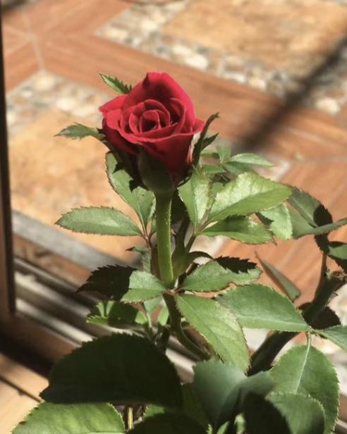
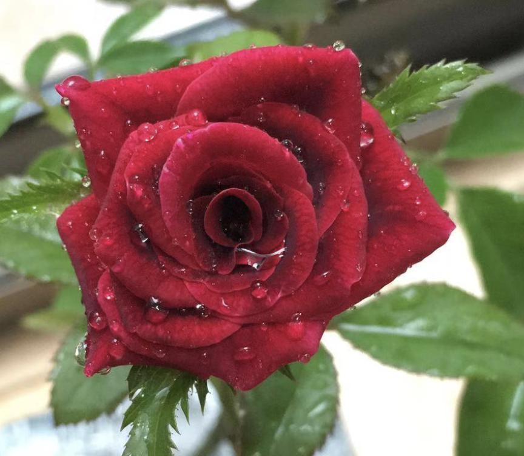
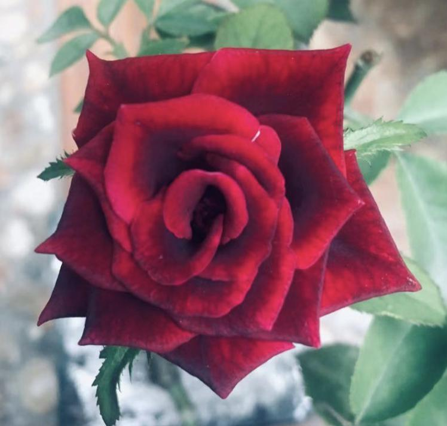
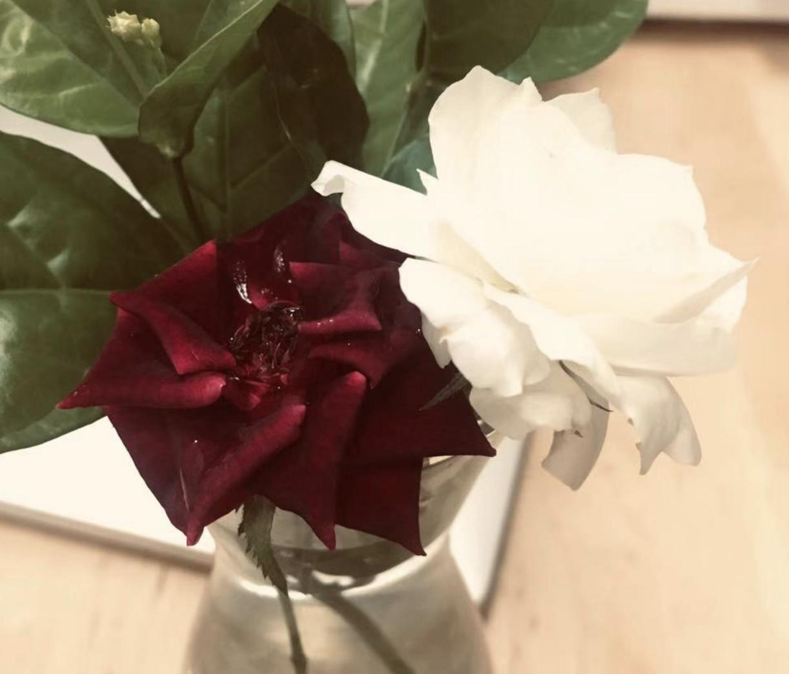
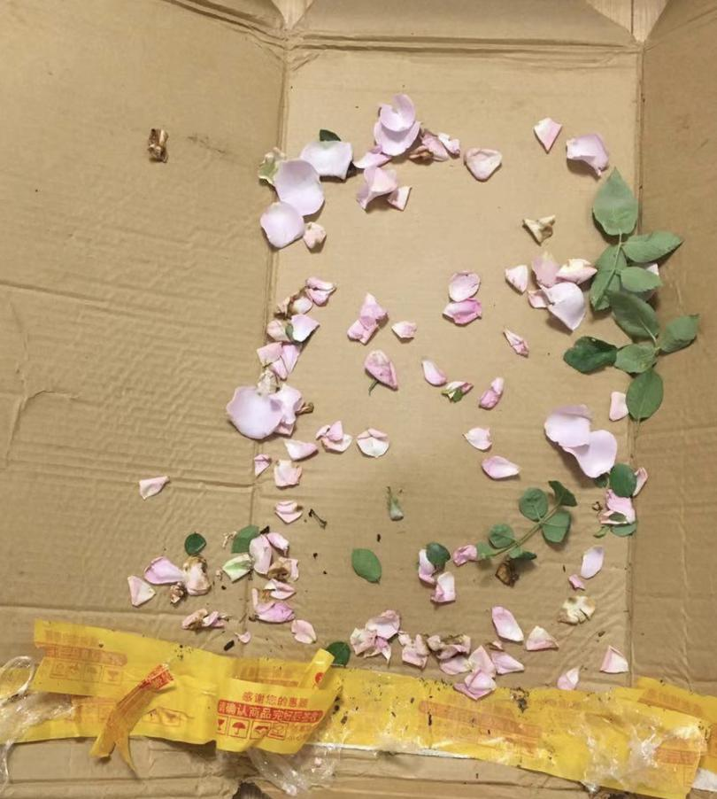
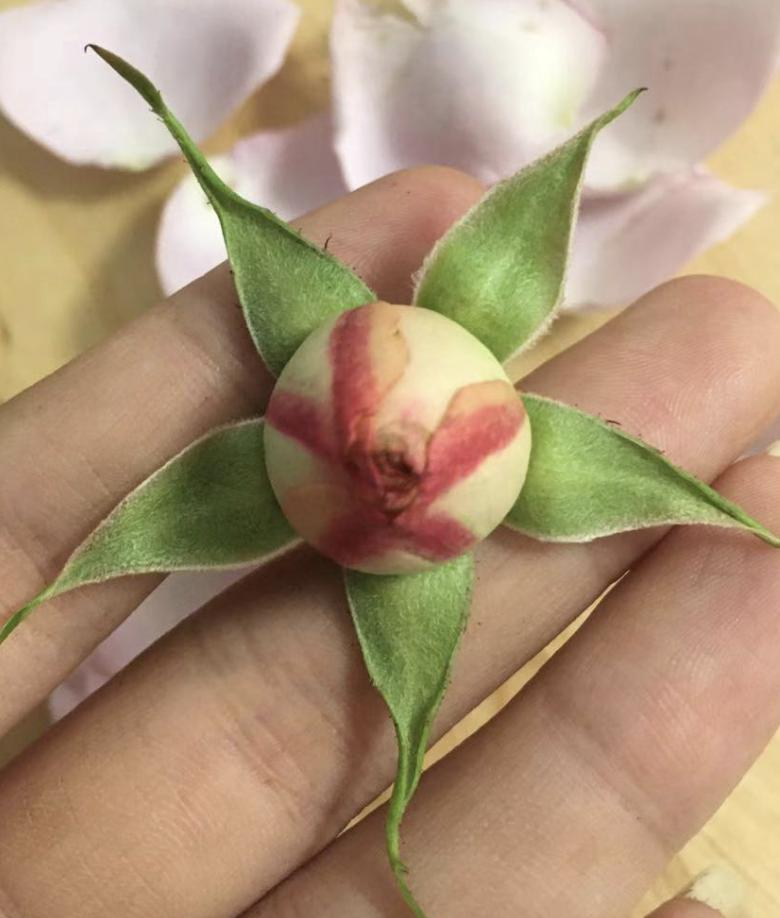
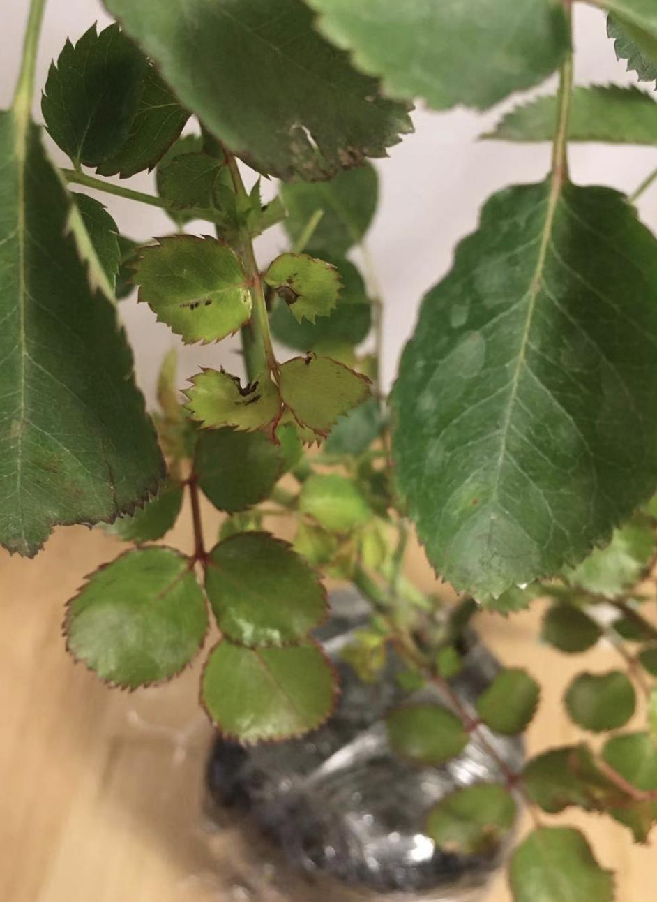

准确的来说，入坑月季的时间是19年。6月的时候在某宝买了三颗月季，品种分别是真宙，心之水滴和诺瓦利斯
三颗来的时候都带着花苞，所以基本上开一轮花应该不是问题，本应该这样，但是实际上第一波花开了的只有真宙和水滴。
真宙和心之水滴很快就开花了，表现良好，但是季节正好是夏，魔都持续高温，再加上是初花，所以花型很散，基本看不出什么型，但是颜色对版，特别是真宙还有股水果香味，还算美丽。

原本最期待的蓝色系的诺瓦利斯并没有那么顺利的开花。刚出两个花苞的那边魔都开始进入到午后暴雨定番的时候了，本应在日程上的盛放就被不断推迟，知道最后艰难的开出了两朵粉色的小花，且当天下午所有花瓣就被暴雨冲落了。o(╥﹏╥)o

这里不得不说夸一下真宙，截止到9月底，真宙开花数超过了10朵且花型肉眼可见的越来越标准，越来越包子，总共开了三波的花，开花机器名不虚传。

尝到甜头之后在8月又入了三个品种：黑巴克，夏洛特夫人，羽毛。

羽毛很不幸的在拆开快递的时候发现一个花苞和一根枝条已经折断了，但是夏洛特夫人和黑巴克状态很棒，不久之后就开花了
黑巴克真的惊艳，夏洛特夫人花型在初花的时候就已经很棒了，羽毛颜色也很不错，这次虽然有遗憾，少了一朵花和枝条，但是初花的花型是真的美。

但是这个三个品种明显开花的频率比不上开花机器，截止到9月底，再打了花苞的只有黑巴克

黑巴克实物真的很黑，从花心向外呈黑色到红色的渐变
*蓟马，蚜虫*

国庆节前后遭遇了一波病虫害，这种时候就能看出来月季不同品种的抗病性的强弱。很明显黑巴克是已拥有的六个品种中抗病性最弱的。蚍虫林兑水喷洒到叶片上直到能滴水为止，大概三天蓟马和蚜虫都消失了。
蚜虫和蓟马没了之后，大部分月季都开始继续一波发芽和生长，但是黑巴克又招了不知道哪里来的小毛虫，抗病性啊抗病性，蚍虫林继续喷也解决了。

*修剪狂魔*

每个人养花草都会有自己的风格，我觉得用个词来形容我的风格的话可能是，修剪狂魔。

好在月季比较皮实，不怕我的修剪，尤其是夏洛特夫人，真宙和诺瓦利斯，同样修剪后追肥的操作，这三个品种对这个操作的受用度最高，诺瓦利斯和夏洛特表现是向上不断生长，真宙则是在中间段出芽同时苗也越来越壮了，竖向生长和横向生长的区别。

夏洛特长太高了，于是给它放了个爬藤架，把枝条沿S形固定到架子上，很多博主说这样有利于打破顶端优势，有利于多花。过几个月看情况吧

---

月季真的是个剁手的玩意儿啊，太上瘾了！！
10月13号，又入了7颗品种的月季，顺便还入了两颗铁线莲。
月季分别是：

蜻蜓 [紫色系] [蕾丝花瓣边] 

永远的那不勒斯 [橙色系] [从外往内红至金色的渐变色，整体复古色系] [耐晒需要勤修剪，不然会长很大] [小苗单头开花，大苗会多头]

金边玫瑰 [红色系] [可食用]

和室 [粉色系] [外瓣为深粉色，内花主要为白色或者非常淡的粉色] [开花机器] [枝条软] [包子]

海洋之歌 [蓝色系] [花型为玫瑰型]

瑞典女王 [杏粉色] [花型优雅]

京 [粉色系] [多头开花] [开花机器] 

铁线莲：
乌托邦[单瓣] [粉白色] [极易养护] [叶片很绿]
魔法喷泉 [重瓣] [正紫色系] [花实在是华丽] [叶片有紫色纹路]

---

9.15 新买的那7颗月季在路上耽搁了3天总算是的到了，到手又是惊呆，原本以为是8朵，店家居然又送了两颗，总共9朵，9朵大部分都带着花来的，有些花都已经盛开了，所以在快递箱里掉了很多的花瓣

既然到手了，那就来记录一下到手的时候9颗的状态和第一印象好了
叶序，脉序，花序，花冠
`和室`: -首先和室是带着花苞来的，花苞打的很大，但是很可惜的是，花苞整个掉落了。光看花苞也能看到颜色很美
花萼首先是正统月季的光滑五片花萼

`奇异盛典` ：- 奇异盛典是店家送的。
叶子：乍一看，叶片有规则的锯齿，嫩叶为红绿色到绿色，带红边，红叶柄，单数羽状复叶，一柄上最多有7片叶子，总体来说和玫瑰较为相似
花苞： 无花苞。
枝条： 绿色，直立性较强，较为粗壮
刺：短且硬直，较为密集，可轻易掰下，

`温柔水晶`： 也是店家送的。
`蜻蜓`: 带着花苞来的额，第二天就盛放了，完全不包，散开状，花瓣波浪边，较硬，硬的花瓣真的挺特别的，花瓣也不易掉落，很适合当切花。
有花香味，具体形容的话就是鲜花饼内馅儿的香味，闻得我想吃鲜花饼了。

永远的那不勒斯
金边玫瑰
海洋之歌
瑞典女王
京

